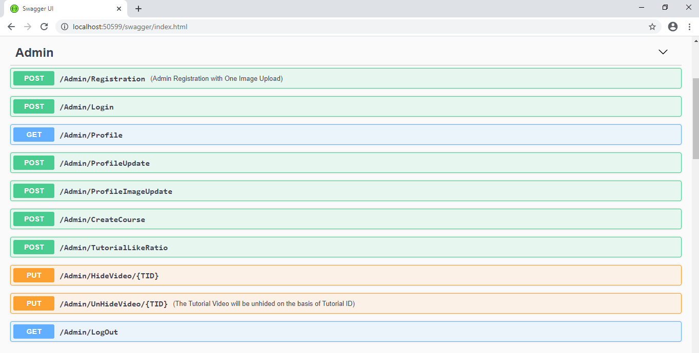
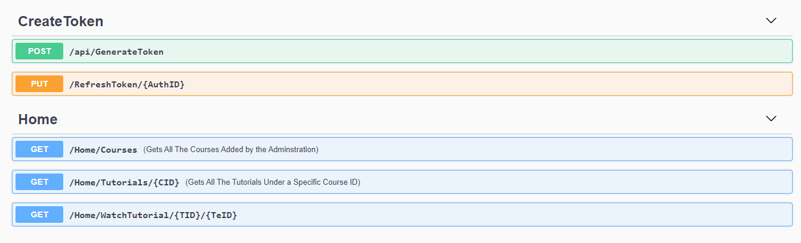
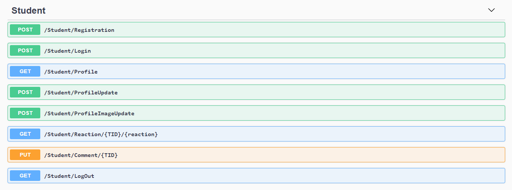
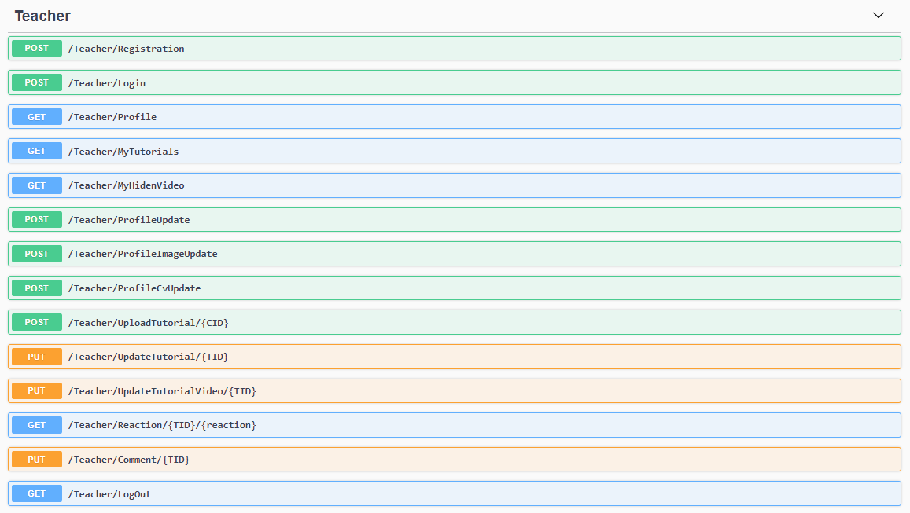

# Online-School-API-

This is a .NET CORE WEB API project. This is a Content based tutorial site, 
Where Teacher can upload video tutorial in a specfic course.
Student can watch Tutorial and Like/Dislike and send comment under a specific tutorial.
Both the Student and Teacher has a profile page in the api based web site.
There is a Admin page in this project as well. Admin can monitor the entire site/application.
Admin can create a Course. 

JWT token has been used for to do Authorization and Authentication.

# Swagger Documentation 

